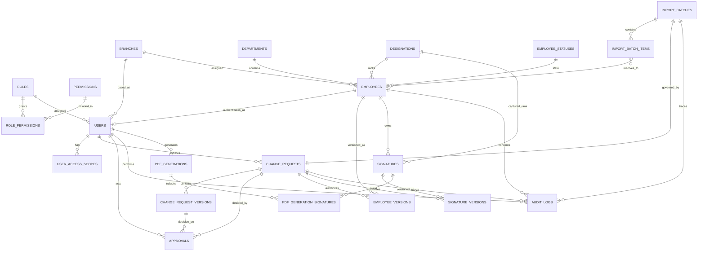

# Employee & Signature Management System

## ERD, database migration, and workflow specification

Status: architecture gate; no business-workflow implementation is authorized until this document is approved.

Database: Microsoft SQL Server. Application: Spring Boot/JPA.

## 1. Decisions and invariants

1. Business rows are never physically deleted. Foreign keys use `NO ACTION`; lifecycle columns perform deactivation and archival.
2. `employees.employee_id` is mandatory, globally unique, immutable after creation, and never reusable. Archived employees retain the unique key.
3. Every proposed employee, user, signature, batch, or configuration change is represented by one `change_requests` header and one or more immutable `change_request_versions`.
4. Corrections create a new request version. Submitted versions are immutable.
5. DGM approval precedes GM approval. A GM decision is invalid unless the same request version has a DGM approval.
6. A DGM/GM initiator may approve their own request. No maker/checker exclusion is added.
7. Approved changes become effective only in the GM-approval transaction.
8. An employee has at most one `ACTIVE` signature of each type (`LOCAL`, `FOREIGN`). Replacement archives the former row; it never overwrites its file.
9. Audit events and approved snapshots are append-only. Corrections are represented by compensating events, never updates/deletes.
10. Authorization and signature scope are enforced in service/repository queries and file-download endpoints, not only in views.
11. IDs displayed to users (`CR-2026-000001`, `BATCH-2026-000001`, audit and PDF IDs) are durable alternate keys. Numeric identities remain internal primary keys.
12. All persisted timestamps use `DATETIME2(7)` in UTC; the UI converts to the configured timezone.

### System-user exemption decision

Only the predefined PD, DGM, GM, and Admin users are workflow-exempt and receive `users.is_system_user = 1`. `AUDIT` is a core role, but every Audit user must follow the normal PD submission → DGM approval → GM approval workflow before activation.

## 2. Logical ERD



Polymorphic request targets are intentionally modeled as `object_type` plus nullable typed foreign keys (`employee_id`, `user_id`, `signature_id`, `batch_id`). A check constraint requires exactly the target appropriate to the object type. This preserves referential integrity; a bare `object_id` alone would not.

## 3. Target table catalog

### Security and master data

| Table | Important columns | Constraints and relationships |
|---|---|---|
| `roles` | `id`, `name`, `description`, `status` | PK `id`; UQ `name`; status check |
| `permissions` | `id`, `permission_key`, `description`, `status` | PK; UQ `permission_key` |
| `role_permissions` | `role_id`, `permission_id`, audit columns | Composite PK; FK to roles/permissions |
| `departments` | `id`, `name`, `status`, audit columns | PK; UQ normalized `name` |
| `designations` | `id`, `name`, `hierarchy_level`, `hierarchy_order`, `status`, audit columns | PK; UQ `name`; UQ active `hierarchy_order`; checks level/order > 0 |
| `branches` | `id`, `code`, `name`, `status`, audit columns | PK; UQ `code`; UQ `name` |
| `employee_statuses` | `id`, `code`, `name`, `terminal`, `display_order` | PK; UQ `code`; seeded lifecycle values |

Hierarchy ordering is read from `designations.hierarchy_order`. No Java switch or enum establishes rank.

### Employees and versions

`employees`

- `id BIGINT IDENTITY` PK.
- `employee_id VARCHAR(30) NOT NULL` with unique constraint. This is the permanent business identifier.
- `name`, `department_id`, `designation_id`, `branch_id`, `grade`, `joining_date`, `effective_date`.
- `employee_status_id NOT NULL` FK to `employee_statuses`.
- `current_version_no INT NOT NULL DEFAULT 1` and optimistic `row_version ROWVERSION`.
- `created_by`, `updated_by` FK to users; UTC timestamps.
- No delete cascade and no endpoint/repository delete operation.

`employee_versions`

- PK `id`; FK `employee_id` (numeric employees PK), `change_request_id`, `changed_by`.
- `version_no`, relational snapshot fields plus `snapshot_json NVARCHAR(MAX)` for a complete display/audit snapshot.
- UQ `(employee_id, version_no)`; JSON validity check `ISJSON(snapshot_json)=1`.
- Append-only database trigger rejects `UPDATE` and `DELETE`.

The current row is a projection for efficient queries; every effective mutation first appends an approved version in the same transaction. Employee ID is excluded from normal update DTOs and guarded by a database trigger against changes.

### Users and authorization scope

`users`

- PK `id`; `user_id VARCHAR(30) NOT NULL` UQ; `employee_id BIGINT NOT NULL` FK/UQ to employees.
- `username` UQ, `password_hash`, `role_id` FK, `branch_id` FK.
- `status`: `PENDING`, `ACTIVE`, `INACTIVE`, `ARCHIVED`, `LOCKED`.
- `is_system_user BIT NOT NULL DEFAULT 0`; only approved seed migration sets it.
- `created_by`, `updated_by`, `approved_by`, `created_at`, `updated_at`, `approved_at`, login/security columns.
- Never physically deleted. Username, user ID, and employee association remain reserved after archival.

`user_access_scopes`

- Composite PK `(user_id, signature_type)`; signature type is `LOCAL` or `FOREIGN`.
- `LOCAL` is one row, `FOREIGN` is one row, and `BOTH` is represented by both rows. The UI may expose the three-value vocabulary while normalized rows make query authorization reliable.

This avoids embedding a growing multi-value permission into a single enum. Scope cannot elevate role permissions: access requires both permission and matching scope.

### Signatures and versions

`signatures`

- PK `id`; `signature_id VARCHAR(40)` UQ; `signature_number VARCHAR(40)` UQ.
- FK `employee_id`, `designation_id`, `created_by`, `updated_by`, `approved_by`, and latest `change_request_id`.
- `signature_type`: `LOCAL` or `FOREIGN`; `version_no`; `file_reference`; `file_sha256`; `mime_type`; `file_size`.
- `status`: `PENDING`, `ACTIVE`, `ARCHIVED`, `REJECTED`, `REVOKED`.
- `effective_from`, `effective_to`, timestamps/IP fields, `archive_reason`, `replaced_by_signature_id` self-FK.
- UQ `(employee_id, signature_type, version_no)`.
- Filtered UQ index: `(employee_id, signature_type) WHERE status='ACTIVE'`.
- Checks: effective-to is null or >= effective-from; archived/revoked rows require a reason; active rows require approval metadata.

`signature_versions` is an append-only snapshot ledger with PK `id`, FKs to signature/employee/designation/change request/users, UQ `(signature_id, version_no)`, all file metadata, status/effective dates, archive reason and timestamps. An old signature file reference is never reused for a new binary; hash verification detects tampering.

Files are stored outside the public static resource tree. Download is via an authorized controller that checks permission, scope, lifecycle visibility, logs the result, and only then streams the file.

### Central workflow

`change_requests`

- PK `id`; `request_number VARCHAR(30)` UQ (for example `CR-2026-000001`).
- `request_type`: `CREATE`, `UPDATE`, `TRANSFER`, `PROMOTION`, `SIGNATURE_REPLACE`, `ACTIVATE`, `DEACTIVATE`, `ARCHIVE`, `IMPORT`, `CONFIG_CHANGE`.
- `object_type`: `EMPLOYEE`, `USER`, `SIGNATURE`, `IMPORT_BATCH`, `DESIGNATION`, `DEPARTMENT`, `ROLE_PERMISSION`.
- Typed nullable target FKs: `employee_id`, `user_id`, `signature_id`, `batch_id`.
- `initiated_by` FK; `status`; `current_version`; rejection/closure metadata; UTC timestamps; `row_version`.
- Check constraint validates the target combination for `object_type` and `current_version >= 1`.

`change_request_versions`

- PK; FK `change_request_id`, `processed_by`/`submitted_by`.
- `version_no`, `submitted_data NVARCHAR(MAX)`, `status`, `submission_comment`, timestamps and IP.
- UQ `(change_request_id, version_no)`; `ISJSON` check.
- Submitted rows are append-only. A filtered UQ index permits only one current working version per request.

`approvals`

- PK; FK `change_request_id`, `change_request_version_id`, `approver_user_id`.
- `approval_level`: `DGM`, `GM`; `action`: `APPROVED`, `REJECTED`; mandatory `comment` for rejection; IP and UTC decision time.
- UQ `(change_request_version_id, approval_level)` prevents duplicate decisions at a level.
- Check constraints validate level/action and rejection comment.
- DGM-before-GM is enforced by the workflow service inside a serializable transaction and by a stored procedure/trigger guard rejecting GM insertion without a DGM approval for the same version. Direct repository writes to approvals are not exposed.

### CSV imports

`import_batches`

- PK; `batch_number` UQ; FK `change_request_id` UQ and `uploaded_by`.
- Immutable original `file_reference`, hash, filename, size, upload timestamp/IP.
- counts with non-negative checks and `total = valid + invalid + duplicate` after validation.
- `status`: `UPLOADED`, `VALIDATING`, `VALIDATED`, `VALIDATION_FAILED`, `PENDING_DGM`, `PENDING_GM`, `REJECTED`, `PROCESSING`, `COMPLETED`, `COMPLETED_WITH_ERRORS`, `ARCHIVED`.

`import_batch_items`

- PK; FK batch and nullable resolved employee; UQ `(batch_id, row_number)`.
- original row JSON, normalized row JSON, validation status/error, duplicate reason, processing status and resulting object IDs.
- Items and original files are retained permanently.

Preview reads only validated staging items. No employee becomes effective until the batch request receives GM approval. Effectuation is idempotent and records per-row outcomes.

### Audit and PDF generation

`audit_logs`

- PK; `audit_event_id VARCHAR(40)` UQ; nullable FKs to actor user, employee, change request and batch.
- action, module, object type/id, old/new JSON, actor role, exact UTC timestamp, IP, result, reason/comment, source, correlation/session ID and metadata JSON.
- Append-only trigger rejects update/delete. Application principal receives only `SELECT`/`INSERT` permission.
- Sensitive values (password hashes, secrets, raw MFA material) are redacted before insertion.

`pdf_generations`

- PK; `generation_id` UQ; FK generated-by user; timestamp/IP; filter JSON; output file reference/hash; result.

`pdf_generation_signatures`

- Composite PK `(pdf_generation_id, signature_id)`; captures signature number and version included, ensuring reproducibility after later archival.

## 4. Foreign-key inventory

All FKs use `ON DELETE NO ACTION` and should be indexed on their child columns.

| Child | Parent |
|---|---|
| `role_permissions.role_id` | `roles.id` |
| `role_permissions.permission_id` | `permissions.id` |
| `employees.department_id/designation_id/branch_id/status_id` | respective master table PK |
| `employees.created_by/updated_by` | `users.id` (nullable during bootstrap only) |
| `employee_versions.employee_id` | `employees.id` |
| `employee_versions.change_request_id` | `change_requests.id` |
| `employee_versions.changed_by` | `users.id` |
| `users.employee_id/role_id/branch_id` | `employees.id` / `roles.id` / `branches.id` |
| `users.created_by/updated_by/approved_by` | `users.id` |
| `user_access_scopes.user_id` | `users.id` |
| `signatures.employee_id/designation_id` | `employees.id` / `designations.id` |
| `signatures.created_by/updated_by/approved_by` | `users.id` |
| `signatures.change_request_id/replaced_by_signature_id` | `change_requests.id` / `signatures.id` |
| `signature_versions.signature_id/employee_id/designation_id` | respective entity PK |
| `signature_versions.change_request_id` | `change_requests.id` |
| `signature_versions.created_by/approved_by` | `users.id` |
| `change_requests.initiated_by` | `users.id` |
| typed request target columns | corresponding employee/user/signature/import-batch PK |
| `change_request_versions.change_request_id` | `change_requests.id` |
| version actor columns | `users.id` |
| `approvals.change_request_id/version_id/approver_user_id` | request/version/user PK |
| `import_batches.change_request_id/uploaded_by` | request/user PK |
| `import_batch_items.batch_id/employee_id` | batch/employee PK |
| `audit_logs.user_id/employee_id/change_request_id/batch_id` | corresponding PK |
| `pdf_generations.generated_by` | `users.id` |
| `pdf_generation_signatures.pdf_generation_id/signature_id` | PDF/signature PK |

There is a bootstrap cycle between system users and employee/audit creator FKs. Resolve it by allowing creator columns to be null only during the seed transaction, inserting master rows and system employees/users, then populating creator references. Do not use cascading deletes to solve the cycle.

## 5. Unique constraints and indexes

### Uniqueness/integrity

- Employees: UQ permanent `employee_id`; UQ `(id, current_version_no)` is unnecessary because `id` is already unique.
- Users: UQ `user_id`, `username`, and `employee_id` (one login per employee unless business explicitly changes this).
- Roles/permissions/master data: UQ stable code/name; designations UQ active hierarchy order.
- Requests/batches/audits/PDFs/signatures: UQ each external formatted identifier.
- Request versions: UQ `(change_request_id, version_no)`.
- Approvals: UQ `(change_request_version_id, approval_level)`.
- Employee/signature versions: UQ `(owner_id, version_no)`.
- Signatures: filtered UQ `(employee_id, signature_type) WHERE status='ACTIVE'`.
- Imports: UQ `(batch_id, row_number)`.

### Query indexes

- Employees: `(status_id, designation_id, department_id, branch_id)` including employee ID/name; separate name search strategy (full-text index if contains-search scale requires it).
- Users: `(status, role_id, branch_id)`; `(employee_id)` already unique.
- Signatures: `(employee_id, signature_type, status)` including version/effective dates; `(status, designation_id)` for books.
- Requests: `(status, created_at)`, `(object_type, status)`, each typed target with status, `(initiated_by, created_at DESC)`.
- Approvals: `(approver_user_id, approved_at DESC)` and `(change_request_id, version_id)`.
- Batches/items: `(status, created_at)`, `(batch_id, validation_status)`, `(batch_id, processing_status)`.
- Audit: `(timestamp DESC)`, `(user_id, timestamp DESC)`, `(employee_id, timestamp DESC)`, `(object_type, object_id, timestamp)`, request/batch/correlation indexes.
- PDF: `(generated_by, generated_at DESC)` and included-signature lookup.

## 6. Controlled values

Use Java enums plus SQL check constraints for workflow values. Use reference tables for admin-maintained business master data.

| Domain | Values |
|---|---|
| Employee lifecycle | `ACTIVE`, `INACTIVE`, `TRANSFERRED`, `RETIRED`, `RESIGNED`, `ARCHIVED` (reference table) |
| User lifecycle | `PENDING`, `ACTIVE`, `INACTIVE`, `LOCKED`, `ARCHIVED` |
| Signature type | `LOCAL`, `FOREIGN` |
| Signature lifecycle | `PENDING`, `ACTIVE`, `ARCHIVED`, `REJECTED`, `REVOKED` |
| Request object | `EMPLOYEE`, `USER`, `SIGNATURE`, `IMPORT_BATCH`, `DESIGNATION`, `DEPARTMENT`, `ROLE_PERMISSION` |
| Request status | `DRAFT`, `PD_ACTION_REQUIRED`, `PENDING_DGM`, `PENDING_GM`, `REJECTED_TO_PD`, `APPROVED`, `EFFECTUATING`, `EFFECTIVE`, `EFFECTUATION_FAILED`, `CANCELLED`, `ARCHIVED` |
| Version status | `DRAFT`, `SUBMITTED`, `DGM_APPROVED`, `GM_APPROVED`, `REJECTED`, `SUPERSEDED`, `EFFECTIVE` |
| Approval | levels `DGM`, `GM`; actions `APPROVED`, `REJECTED` |
| Access scope | UI: `LOCAL`, `FOREIGN`, `BOTH`; persistence: LOCAL/FOREIGN rows |
| Audit source/result | `UI`, `API`, `IMPORT`, `SYSTEM`; `SUCCESS`, `FAILURE`, `DENIED` |

`TRANSFERRED` is a business event/status only if the employee leaves the managed population. An internal branch/department transfer normally preserves `ACTIVE` and records request type `TRANSFER`, with old placement preserved in `employee_versions`.

## 7. State transitions

### Standard PD-submitted creation (employee, user, signature, import)

```text
DRAFT --submit by PD--> PENDING_DGM
PENDING_DGM --DGM approve--> PENDING_GM
PENDING_GM --GM approve--> EFFECTUATING --> EFFECTIVE
PENDING_DGM --DGM reject(reason)--> REJECTED_TO_PD
PENDING_GM --GM reject(reason)--> REJECTED_TO_PD
REJECTED_TO_PD --PD corrects--> new version DRAFT
new version --submit--> PENDING_DGM
```

The rejected version becomes `REJECTED`; the corrected version increments `version_no`. Earlier approval rows remain attached to the earlier version. New approvals are required for the new version.

### DGM/GM-initiated employee change

```text
DGM/GM initiates --> PD_ACTION_REQUIRED
PD records proposed change as version N --> PENDING_DGM
DGM approves --> PENDING_GM
GM approves --> EFFECTUATING --> EFFECTIVE
```

The initiator is permitted to make the relevant DGM/GM approval. PD cannot update the effective employee directly: only the GM-approval effectuation handler applies the submitted snapshot.

### Rejection rules

- Rejection is allowed only from `PENDING_DGM` or `PENDING_GM` and requires a nonblank comment.
- It transitions the header to `REJECTED_TO_PD` and current version to `REJECTED`.
- PD correction inserts version N+1; it never updates version N.
- A new version invalidates no history but requires a fresh DGM then GM sequence.

### Signature replacement transaction

After GM approval, in one transaction: lock active signature for `(employee,type)`; append archive snapshot; set old row `ARCHIVED`, effective-to and reason; insert new `ACTIVE` signature/version with its own immutable file; link `replaced_by`; append audits. The filtered unique index is the final concurrency guard.

### User activation

Non-system users begin `PENDING`. GM effectuation sets role, permission mapping reference/scope and status `ACTIVE`, with approval metadata. Deactivation/reactivation/role/scope changes are themselves change requests. System seed users bypass request creation only when `is_system_user=1` and the source is `SYSTEM`.

### Invalid transitions

- GM approval before DGM approval.
- Approval/rejection against a stale request version.
- PD direct mutation of an effective employee/signature/user.
- Resubmitting without a new version.
- Activating a second signature with the same employee/type.
- Changing an employee business ID.
- Viewing/downloading a signature outside user scope.

Use optimistic row versions plus transactional status predicates so double-clicks and concurrent approvers cannot apply twice.

## 8. RBAC baseline

Permissions should be granular keys, for example `EMPLOYEE_CREATE_PROPOSAL`, `EMPLOYEE_PROCESS_CHANGE`, `EMPLOYEE_VIEW`, `USER_CREATE_PROPOSAL`, `USER_ADMINISTER`, `SIGNATURE_VIEW_LOCAL`, `SIGNATURE_VIEW_FOREIGN`, `SIGNATURE_DOWNLOAD`, `SIGNATURE_VIEW_ARCHIVED`, `REQUEST_INITIATE`, `REQUEST_APPROVE_DGM`, `REQUEST_APPROVE_GM`, `IMPORT_UPLOAD`, `AUDIT_VIEW`, `AUDIT_EXPORT`, `PDF_GENERATE`, and `CONFIG_ADMINISTER`.

- PD: create employee/user proposals, process authorized changes, imports, view active and archived signatures.
- DGM: initiate employee changes and DGM decisions.
- GM: initiate employee changes and GM decisions.
- Admin: configuration, role/permission and user administration through workflows; archived signature access.
- Audit: read/export audit and history, including archived signatures; no mutation/approval authority by default.

Controller URL roles are defense-in-depth only. Service methods use method security and repository predicates. File access checks `SIGNATURE_VIEW`/`DOWNLOAD`, active/archive permission, and LOCAL/FOREIGN scope.

## 9. Migration plan from the current schema

Each migration is separately versioned, idempotent where practical, backed up, tested on a production-sized clone, and accompanied by validation queries. Prefer Flyway or Liquibase after capturing the existing `schema.sql` as a baseline.

### Phase 0 — baseline and data-quality gate

1. Back up database and file store; record counts and hashes.
2. Inventory duplicates/nulls/orphan paths and current SQL types.
3. Resolve the current mismatch: `users.branch_id VARCHAR` becomes a real BIGINT FK after parsing existing numeric IDs and quarantining invalid values.
4. Fix the stray non-idempotent `database/update.sql` statement before adopting migrations.
5. Freeze physical deletes at application and DB permission levels.

Abort migration on duplicate employee IDs, usernames, signature numbers, invalid branch references, or missing current files; produce a remediation report rather than silently coercing data.

### Phase 1 — additive security/master schema

Create permissions, role-permissions, normalized department/designation/branch structures, hierarchy columns, employee statuses, user status/audit/scope columns, and `user_access_scopes`. Seed stable codes and the full configurable hierarchy. Add the `AUDIT` role; retire `BRANCH` only after mapping its users to intended roles/scopes.

### Phase 2 — central workflow and immutable audit

Create sequence/counter infrastructure for formatted IDs, `change_requests`, versions, approvals and `audit_logs`, including checks, indexes, append-only triggers, and restricted SQL grants. Backfill each existing `employee_request` as a central request with version 1 and map `approval_history`; preserve original legacy IDs in migration metadata.

### Phase 3 — employee normalization/version backfill

Add employee lifecycle/current-version/audit columns. Create `employee_versions`; backfill version 1 from every current employee and link the originating approved request where discoverable. Add immutability trigger for employee business ID. Keep old media columns readable during dual-read.

### Phase 4 — signature extraction

Create signatures and signature versions. Convert each non-null local/foreign path into separate typed signature rows and snapshots. Generate stable signature IDs/numbers, hashes and effective dates. Resolve duplicate-active conflicts before enabling the filtered unique index. Dual-write through a compatibility service temporarily; do not overwrite old files.

### Phase 5 — user approval migration

Backfill `user_id`, employee FK, status and scope. System seed users receive `is_system_user=1`; all other existing active users need an explicit migration authorization record or are placed into a review state. Add NOT NULL/FKs only after backfill validation. Move future user creation behind central requests.

### Phase 6 — import and PDF ledgers

Create batch/item and PDF generation/inclusion tables, protected storage areas and auditing. Implement validation preview before effectuation. Store original CSV and generated PDF hashes.

### Phase 7 — application cutover

1. Introduce services in this order: audit context, authorization/scope, request state machine, employee versions, signatures, users, imports, PDFs.
2. Replace direct entity saves with approved command/effectuation handlers.
3. Add `@PreAuthorize` and ownership/scope query predicates.
4. Replace public `/uploads/**` access with authorized streaming endpoints.
5. Add authentication success/failure/logout listeners and MFA integration points.
6. Run dual-read reconciliation, then switch reads to normalized tables.

### Phase 8 — legacy retirement

After at least one verified release and count/hash reconciliation, revoke writes to `employee_requests`, `approval_history`, `employee_media_versions`, and employee signature-path columns. Rename them to `_legacy` or expose read-only compatibility views. Do not drop them until the formal retention policy authorizes it; no business history is deleted.

## 10. Migration verification gates

- Row counts and orphan-FK checks pass for every phase.
- Every current employee has exactly one backfilled employee version.
- Every legacy signature path maps to a signature version and a verified file/hash.
- No employee/type has more than one active signature.
- Every approved/effective request version has DGM then GM approvals, except explicitly tagged system migration records.
- All rejected legacy requests remain available and are not represented as overwritten versions.
- Every non-system active user has approval or migration-authorization provenance.
- Direct SQL `UPDATE`/`DELETE` against audit/version tables fails under the application principal.
- Scope tests prove LOCAL cannot fetch FOREIGN, FOREIGN cannot fetch LOCAL, and BOTH can fetch both, including guessed file URLs.
- Concurrency tests prove duplicate approvals, double effectuation and duplicate active signatures fail safely.

## 11. Current-system gap map

| Current behavior | Required target |
|---|---|
| `employee_requests` only, no universal request number | Central typed request and formatted immutable number |
| Rejected request row is edited and resubmitted | Immutable rejected version plus version N+1 |
| Employee and local/foreign files share one row | Independent typed signature records and versions |
| Media-only versions | Full employee and signature snapshots |
| Admin creates active users directly | PD → DGM → GM user workflow, except explicit system seeds |
| Boolean update flags | Explicit state machine and authorized PD task |
| No append-only audit | Immutable audit ledger with view/download/security events |
| `/uploads/**` allowed to any authenticated user | Permission/scope-checked file streaming |
| Designation has no hierarchy ordering | Admin-maintained hierarchy level/order |
| `users.branch_id` is text without FK | BIGINT FK to branches |
| No batch import ledger | Immutable batch, items, preview and approvals |
| PDF has no generation ledger | Generation/filter/included-signature audit records |

## 12. Implementation gate acceptance criteria

Business workflow coding may begin only after stakeholders confirm:

1. Whether one employee may ever own multiple login accounts; default is one.
2. Who is allowed to create non-system user proposals; this specification follows the explicit PD → DGM → GM rule.
3. The formal signature-number format and employee-ID normalization rules.
4. Retention duration and encryption/key-management requirements for signature, CSV and PDF files.
5. Whether an internal transfer keeps employee status `ACTIVE` (recommended) or uses `TRANSFERRED`.
6. Whether cancellation is allowed and by whom; cancellation never deletes history.
7. MFA provider and recovery policy for Admin/DGM/GM.

Once approved, the first coding deliverable should be Phase 0 validation scripts and versioned additive migrations—not controller workflow changes.
