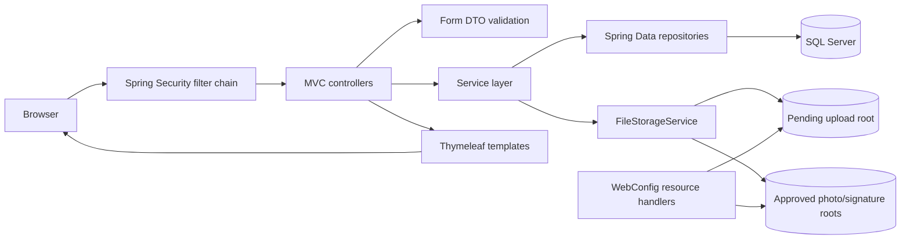
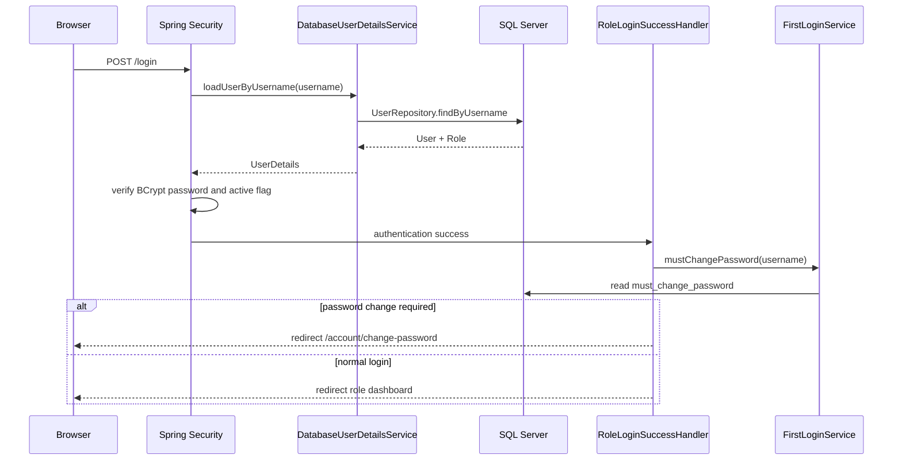
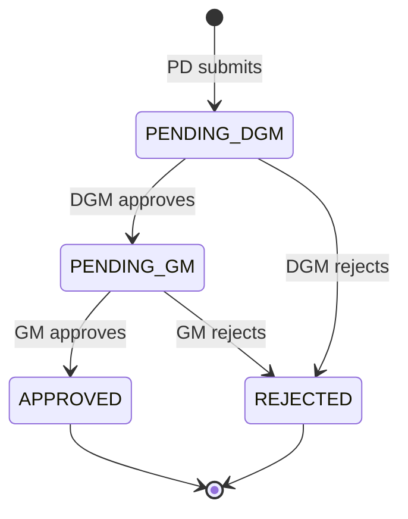
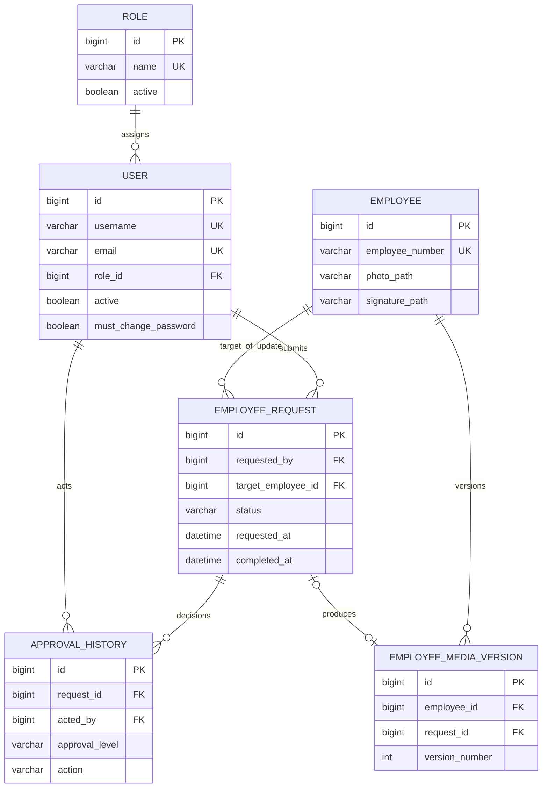
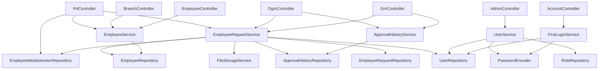

# Employee Signature Management System

## Comprehensive Developer Guide

> Audience: developers maintaining, debugging, refactoring, or extending this application. This document describes the code as it currently exists. Paths are relative to the directory containing `pom.xml`.

## 1. System overview

### 1.1 Purpose

This application is an internal bank employee signature-management system. It provides a controlled process for creating and updating employee identity records, including profile photographs and specimen signatures.

Its main business goals are to:

- Keep a single current, approved employee record.
- Prevent Personnel Department (PD) submissions from becoming visible as official records before approval.
- Require sequential DGM and GM decisions.
- Retain an immutable-looking business history of approval decisions.
- Preserve every GM-approved photo/signature pair as a numbered media version.
- Restrict capabilities by role.
- Let authorized users search approved employees and inspect signatures.

Its technical goals are to:

- Keep HTTP, business, persistence, security, and presentation responsibilities separated.
- Make request state transitions transactional.
- Store uploaded media outside the application JAR.
- Validate the database schema at startup instead of modifying it implicitly.
- Use server-side authentication, authorization, validation, and rendering.

### 1.2 When this code should be used

Use the application when employee records must enter a review queue and become authoritative only after two approval levels. It is suitable for an internal, database-backed, server-rendered workflow deployed with access to SQL Server and persistent filesystem storage.

Do not treat it as a general document-management system, digital-signature cryptography service, public employee directory, or full audit/session-monitoring solution. `ApprovalHistory` records business decisions only; it is not a security audit log.

### 1.3 Current scope

The application supports:

- Database-backed login and BCrypt password hashes
- ADMIN, PD, DGM, GM, and BRANCH roles
- Mandatory password change for most newly created/reset users
- User creation, editing, activation, and deactivation
- New employee requests
- Existing employee update requests
- DGM then GM approval or rejection
- Approved employee search and cards
- Approval decision history per approver
- Approved photo/signature version history
- JPG/PNG upload validation and preview

## 2. Technology and runtime model

| Area                  | Implementation                                 |
|-----------------------|------------------------------------------------|
| Language/runtime      | Java 21                                        |
| Framework             | Spring Boot 4.1.0                              |
| Web                   | Spring MVC, embedded servlet container         |
| Views                 | Thymeleaf, Bootstrap-oriented HTML             |
| Authentication        | Spring Security form login                     |
| Persistence           | Spring Data JPA and Hibernate                  |
| Database              | Microsoft SQL Server                           |
| Passwords             | BCrypt                                         |
| Validation            | Jakarta Bean Validation plus service checks    |
| Media                 | Local filesystem with database path references |
| Build                 | Maven                                          |
| Monitoring dependency | Spring Boot Actuator                           |

No external HTTP APIs, cache, message queue, scheduler, or cloud object store is used. The only external stateful dependencies are SQL Server and the configured filesystem roots.

## 3. High-level architecture



### 3.1 Layer responsibilities

- **Security layer:** authenticates users, applies role-based URL rules, forces first-login password changes, and redirects users to role dashboards.
- **Controller layer:** binds request parameters/forms, invokes services, adds model attributes, handles expected validation/business failures, and chooses views or redirects.
- **DTO layer:** defines web-form shape and basic declarative validation.
- **Service layer:** owns business rules, transformations, and transaction boundaries.
- **Repository layer:** exposes database operations and fetch plans.
- **Entity layer:** maps domain state to SQL tables.
- **View layer:** renders role-specific pages and submits forms.
- **Storage layer:** validates, stores, moves, resolves, and deletes media files.

Keep business state transitions in services. Controllers should coordinate HTTP behavior, repositories should not contain workflow policy, and templates/JavaScript must not be treated as security boundaries.

## 4. Execution and function-call flows

### 4.1 Application startup

```text
EmployeeSignatureApplication.main
└─ SpringApplication.run
   ├─ component scanning under com.bank.signaturemanagement
   ├─ datasource/JPA initialization
   ├─ Hibernate schema validation
   ├─ SecurityFilterChain creation
   ├─ WebConfig resource-handler registration
   └─ InitialDataConfig CommandLineRunner
      ├─ ensure five Role rows exist
      └─ create admin user if username "admin" does not exist
```

Startup requires a reachable SQL Server whose schema matches the entities. Because `spring.jpa.hibernate.ddl-auto=validate`, Hibernate does not create missing columns or tables.

### 4.2 Login and first-password-change flow



`FirstLoginPasswordFilter` repeats the password-change check on later requests. This prevents a user from bypassing the success-handler redirect by manually entering another URL. Exempt usernames configured in `app.first-login.exempt-users` bypass the requirement.

Password change call hierarchy:

```text
AccountController.change
└─ FirstLoginService.changePassword
   ├─ UserRepository.findByUsername
   ├─ PasswordEncoder.matches(current, stored)
   ├─ compare new and confirmation
   ├─ reject reuse of current password
   └─ PasswordEncoder.encode(new) + set mustChangePassword=false
└─ HttpServletRequest.logout
```

### 4.3 New employee request

```text
POST /pd/employees
└─ PdController.create
   ├─ Jakarta validation of EmployeeRequestForm
   └─ EmployeeRequestService.createRequest [transaction]
      ├─ normalize employee code/text
      ├─ EmployeeRepository duplicate check
      ├─ EmployeeRequestRepository pending-code check
      ├─ UserRepository.findByUsername
      ├─ FileStorageService.validateImage(photo, signature)
      ├─ FileStorageService.storeImage twice
      └─ EmployeeRequestRepository.save (default PENDING_DGM)
```

The request stores a complete snapshot. No `Employee` row is created yet.

### 4.4 Employee update request

```text
POST /pd/employees/{id}/edit
└─ PdController.updateEmployee
   ├─ Jakarta validation of EmployeeUpdateForm
   └─ EmployeeRequestService.createUpdateRequest [transaction]
      ├─ load target Employee
      ├─ reject another pending update for target
      ├─ validate employee-code uniqueness
      ├─ load requesting User
      ├─ retain current media paths when uploads are empty
      ├─ validate/store optional replacement media
      └─ save EmployeeRequest linked to target Employee
```

An update request is distinguished by non-null `target_employee_id`. The approved employee remains unchanged until GM approval.

### 4.5 Approval flow



DGM hierarchy:

```text
DgmController.decide
└─ EmployeeRequestService.dgmDecision [transaction]
   ├─ requireStatus(id, PENDING_DGM)
   ├─ load acting User
   ├─ parseAction("approve" | "reject")
   ├─ saveHistory(level=DGM, mandatory remark)
   ├─ set PENDING_GM or REJECTED
   └─ on rejection: delete pending images + set completedAt
```

GM hierarchy:

```text
GmController.decide
└─ EmployeeRequestService.gmDecision [transaction]
   ├─ requireStatus(id, PENDING_GM)
   ├─ load acting User
   ├─ parse action and save GM history
   ├─ if approved
   │  ├─ create or update Employee
   │  ├─ enforce employee-code uniqueness
   │  ├─ saveAndFlush Employee to obtain ID
   │  ├─ organize photo and signature into approved roots
   │  ├─ update Employee and request paths
   │  ├─ calculate version as count(employee versions) + 1
   │  └─ save EmployeeMediaVersion
   ├─ if rejected: delete pending replacement images
   └─ set final status and completedAt
```

Every decision creates `ApprovalHistory` before the request status is changed. A thrown runtime exception rolls back database changes in the transaction, but filesystem changes cannot automatically participate in that rollback.

### 4.6 Search and view flow

```text
GET /employees or /branch/dashboard
└─ EmployeeService.search(query, page)
   └─ EmployeeRepository.findByEmployeeNumberContainingIgnoreCaseOrFullNameContainingIgnoreCase
      └─ PageRequest(page, 20)
```

Employee detail pages load an approved `Employee` by numeric ID. Thymeleaf builds media URLs as `/uploads/` plus the stored logical path. `WebConfig` maps those paths to configured directories.

## 5. Data model and state



### 5.1 Entities and constraints

- `Role`: unique name, description, and active flag. Role active state is stored but is not currently checked during authentication.
- `User`: unique username/email, BCrypt hash, one role, active flag, mandatory-change flag, creation timestamp.
- `Employee`: unique employee number and the current approved information/media paths.
- `EmployeeRequest`: submitter, optional target employee, proposed snapshot, status, remark, timestamps.
- `ApprovalHistory`: request, actor, level (`DGM`/`GM`), action (`APPROVED`/`REJECTED`), mandatory remark, timestamp.
- `EmployeeMediaVersion`: employee, optional originating request, per-employee version number, media paths, approval time.

Important database constraints and indexes live in `database/schema.sql`, including status/action checks, foreign keys, unique employee/version constraints, and indexes for request queues and searches.

### 5.2 Data transformation rules

- Service methods trim textual input before persistence.
- New requests require both image files; update requests make both replacements optional.
- File extensions are derived from accepted MIME type, not the submitted filename.
- Filenames are random UUIDs.
- Request data becomes approved employee data only in `gmDecision`.
- Approved media paths replace pending paths on both `Employee` and `EmployeeRequest`.
- JPA lifecycle logic updates `Employee.updatedAt` before an update.

## 6. Complete code and resource inventory

### 6.1 Root files

| Path                  | Responsibility                                                                             |
|-----------------------|--------------------------------------------------------------------------------------------|
| `pom.xml`             | Maven coordinates, Java version, Spring Boot parent, dependencies, and packaging plugin.   |
| `database/schema.sql` | Idempotent-oriented SQL Server database/table/index/role setup and media-version backfill. |
| `DEVELOPER_GUIDE.md`  | This maintenance guide.                                                                    |

### 6.2 Application entry point

| File                                | Responsibility                                                                                            |
|-------------------------------------|-----------------------------------------------------------------------------------------------------------|
| `EmployeeSignatureApplication.java` | `@SpringBootApplication` root and `main` method. Its package defines the default component-scan boundary. |

### 6.3 Configuration

| File                            | Responsibility and coupling                                                                                                                              |
|---------------------------------|----------------------------------------------------------------------------------------------------------------------------------------------------------|
| `config/SecurityConfig.java`    | BCrypt bean, URL authorization, login/logout configuration, success handler, and first-login filter placement. Coupled to role names and route prefixes. |
| `config/InitialDataConfig.java` | Ensures roles and initial admin exist at startup. Coupled to role names, `RoleLoginSuccessHandler`, schema, and initial-password property.               |
| `config/WebConfig.java`         | Maps `/uploads/**` URLs to pending and approved filesystem roots supplied by `FileStorageService`.                                                       |

### 6.4 Security

| File                                       | Responsibility and important methods                                                                                         |
|--------------------------------------------|------------------------------------------------------------------------------------------------------------------------------|
| `security/DatabaseUserDetailsService.java` | `loadUserByUsername`: maps `User` and `Role` to Spring Security `UserDetails`; disabled state is derived from `User.active`. |
| `security/RoleLoginSuccessHandler.java`    | `onAuthenticationSuccess`: checks mandatory password change then maps a single authority to its dashboard.                   |
| `security/FirstLoginPasswordFilter.java`   | `doFilterInternal`: redirects authenticated non-exempt users to password change unless the request path is allowed.          |

### 6.5 Controllers and routes

| File                                 | Routes                                                                       | Responsibility                                                                     |
|--------------------------------------|------------------------------------------------------------------------------|------------------------------------------------------------------------------------|
| `controller/AuthController.java`     | `GET /`, `GET /login`                                                        | Login view and root redirect.                                                      |
| `controller/AccountController.java`  | `GET/POST /account/change-password`                                          | Password form, service invocation, validation errors, and logout after success.    |
| `controller/AdminController.java`    | `/admin/dashboard`, `/admin/users`, user edit/toggle routes                  | User administration and role list models.                                          |
| `controller/PdController.java`       | PD dashboard, request creation/listing, employee update, approved signatures | PD workflow coordination.                                                          |
| `controller/DgmController.java`      | DGM dashboard, review/decision, decision history                             | First-level approval coordination.                                                 |
| `controller/GmController.java`       | GM dashboard, review/decision, decision history                              | Final approval coordination.                                                       |
| `controller/BranchController.java`   | Branch search dashboard and employee card                                    | Branch-specific approved employee access.                                          |
| `controller/EmployeeController.java` | `/employees`, `/employees/{id}`                                              | Common authenticated directory/card; derives the first authority as `currentRole`. |

Controllers intentionally catch expected `IllegalArgumentException`/`IllegalStateException` only in selected form flows. Unexpected failures currently fall through to Spring Boot's default error handling.

### 6.6 DTOs

| File                           | Fields and validation                                                                                                             |
|--------------------------------|-----------------------------------------------------------------------------------------------------------------------------------|
| `dto/ApprovalForm.java`        | Required decision remark. Controllers currently bind it but do not apply `@Valid`; the service still enforces non-blank remarks.  |
| `dto/EmployeeRequestForm.java` | Required employee code, name, designation, department, branch, remark; photo/signature validated by `FileStorageService`.         |
| `dto/EmployeeUpdateForm.java`  | Same required text fields; optional replacement photo/signature.                                                                  |
| `dto/PasswordChangeForm.java`  | Required current/new/confirmation fields; new password minimum eight characters. Cross-field and reuse checks are in the service. |
| `dto/UserForm.java`            | Username/password/name/email/role validation including lengths, email format, and password minimum.                               |
| `dto/UserUpdateForm.java`      | Required name/email/role, optional reset password, active flag. Password length is checked in `UserService`.                      |

### 6.7 Services

| File                                  | Responsibility                                                                                                                                      |
|---------------------------------------|-----------------------------------------------------------------------------------------------------------------------------------------------------|
| `service/EmployeeRequestService.java` | Central request workflow, state transitions, approval history, employee publication, and media version creation. Highest business-risk class.       |
| `service/ApprovalHistoryService.java` | Read-only paginated approver decision history, fixed at 20 rows/page.                                                                               |
| `service/EmployeeService.java`        | Approved employee search/load and update-form creation.                                                                                             |
| `service/FileStorageService.java`     | Image validation, pending storage, approved organization, rejected-file cleanup, root resolution, and path confinement. Highest storage-risk class. |
| `service/UserService.java`            | User CRUD-like operations, uniqueness checks, role lookup, BCrypt password handling, status toggle.                                                 |
| `service/FirstLoginService.java`      | First-login exemption checks and password change rules.                                                                                             |

### 6.8 Repositories

| File                                             | Queries                                                                                                  |
|--------------------------------------------------|----------------------------------------------------------------------------------------------------------|
| `repository/UserRepository.java`                 | User/role fetches, paging, username/email uniqueness, name search. Entity graphs load role where needed. |
| `repository/RoleRepository.java`                 | Role lookup and existence by name.                                                                       |
| `repository/EmployeeRepository.java`             | ID/code operations, duplicate checks, paginated code-or-name search.                                     |
| `repository/EmployeeRequestRepository.java`      | Request fetch with requester, pending queues, submitter history, pending code/target checks.             |
| `repository/ApprovalHistoryRepository.java`      | History by request or by actor+level, with entity graphs for view-required relationships.                |
| `repository/EmployeeMediaVersionRepository.java` | Descending version list and count by employee.                                                           |

`@EntityGraph` is important because Open Session in View is disabled. Removing a required graph can cause `LazyInitializationException` in templates after the transaction closes.

### 6.9 Entities and enums

| File                               | Responsibility                                                                        |
|------------------------------------|---------------------------------------------------------------------------------------|
| `entity/User.java`                 | User table mapping and account state.                                                 |
| `entity/Role.java`                 | Role table mapping.                                                                   |
| `entity/Employee.java`             | Approved/current employee mapping and update timestamp callback.                      |
| `entity/EmployeeRequest.java`      | Proposed snapshot and approval state mapping.                                         |
| `entity/ApprovalHistory.java`      | Approval decision record mapping.                                                     |
| `entity/EmployeeMediaVersion.java` | Approved media version mapping.                                                       |
| `entity/RequestStatus.java`        | `PENDING_DGM`, `PENDING_GM`, `APPROVED`, `REJECTED`. Must match SQL check constraint. |
| `entity/ApprovalAction.java`       | `APPROVED`, `REJECTED`. Must match SQL check constraint and action parsing.           |

### 6.10 Templates

| Path                                            | Responsibility                                                                      |
|-------------------------------------------------|-------------------------------------------------------------------------------------|
| `templates/login.html`                          | Custom form-login page and login/logout/password-change messages.                   |
| `templates/account/change-password.html`        | Mandatory/current password-change form and logout action.                           |
| `templates/admin/dashboard.html`                | Admin landing page and quick actions.                                               |
| `templates/admin/users.html`                    | Paginated users, new-user form, toggle/edit actions.                                |
| `templates/admin/edit-user.html`                | Existing-user update/password-reset form.                                           |
| `templates/pd/dashboard.html`                   | PD landing page and workflow links.                                                 |
| `templates/pd/create-employee.html`             | New request multipart form and image previews.                                      |
| `templates/pd/edit-employee.html`               | Update request form with current and optional replacement media.                    |
| `templates/pd/request-list.html`                | Current PD user's submission history.                                               |
| `templates/pd/employee-list.html`               | Search/select employee for update.                                                  |
| `templates/pd/approved-signatures.html`         | Search approved employees for media history.                                        |
| `templates/pd/approved-signature-versions.html` | All approved media versions for one employee.                                       |
| `templates/dgm/dashboard.html`                  | Oldest-first `PENDING_DGM` queue.                                                   |
| `templates/dgm/request-review.html`             | Wrapper around shared review fragment for DGM.                                      |
| `templates/dgm/approval-history.html`           | Wrapper around shared history fragment for DGM.                                     |
| `templates/gm/dashboard.html`                   | Oldest-first `PENDING_GM` queue.                                                    |
| `templates/gm/request-review.html`              | Wrapper around shared review fragment for GM.                                       |
| `templates/gm/approval-history.html`            | Wrapper around shared history fragment for GM.                                      |
| `templates/branch/dashboard.html`               | Branch employee search.                                                             |
| `templates/branch/employee-card.html`           | Branch-specific approved employee card.                                             |
| `templates/employee/directory.html`             | Shared authenticated approved employee directory.                                   |
| `templates/employee/card.html`                  | Shared card; shows edit link only for PD.                                           |
| `templates/fragments/head.html`                 | Shared metadata/styles and page title fragment.                                     |
| `templates/fragments/navbar.html`               | Shared top navigation, role display, and account controls.                          |
| `templates/fragments/sidebar.html`              | Role-specific navigation and active-page state. Coupled to role strings and routes. |
| `templates/fragments/layout.html`               | Shared flash messages, footer, and scripts.                                         |
| `templates/fragments/request-review.html`       | Shared DGM/GM request review and decision form.                                     |
| `templates/fragments/approval-history.html`     | Shared DGM/GM decision table.                                                       |

### 6.11 Static resources and configuration

| Path                                                 | Responsibility                                                                                                                                         |
|------------------------------------------------------|--------------------------------------------------------------------------------------------------------------------------------------------------------|
| `static/js/app.js`                                   | Image MIME/5 MB client checks and preview URLs, password show/hide, responsive sidebar. Client checks are convenience only.                            |
| `static/css/style.css`                               | Shared visual foundation and component styles.                                                                                                         |
| `static/css/dashboard.css`                           | Dashboard/layout/table/card/sidebar styles.                                                                                                            |
| `static/css/login.css`                               | Login-specific presentation.                                                                                                                           |
| `static/css/images/uttara-bank-limited-seeklogo.png` | Brand image used by views.                                                                                                                             |
| `application.properties`                             | Datasource, Hibernate, Thymeleaf, upload roots, initial account, exemptions, and multipart limits. Treat values as environment-specific and sensitive. |

### 6.12 Tests

| Path                                                                                | Current coverage                                                                                          |
|-------------------------------------------------------------------------------------|-----------------------------------------------------------------------------------------------------------|
| `src/test/java/com/bank/signaturemanagement/EmployeeSignatureApplicationTests.java` | Only verifies that the application entry-point class can be loaded. It does not start the Spring context. |

## 7. Internal and external dependency map

### 7.1 Internal dependencies



### 7.2 External Maven dependencies

| Dependency                       | Used for                                       | Change impact                                                                                      |
|----------------------------------|------------------------------------------------|----------------------------------------------------------------------------------------------------|
| `spring-boot-starter-web`        | MVC, servlet runtime, multipart handling       | Major-version changes may affect controllers, servlet APIs, resource mappings, and error behavior. |
| `spring-boot-starter-thymeleaf`  | Server-side HTML rendering                     | Expression/fragment behavior changes affect all templates.                                         |
| `spring-boot-starter-data-jpa`   | Transactions, repositories, Hibernate          | Mapping/fetch/transaction changes can break startup and lazy loading.                              |
| `spring-boot-starter-security`   | Login, BCrypt integration, CSRF, authorization | Changes can expose routes or break login/session flows; validate end to end.                       |
| `spring-boot-starter-validation` | DTO constraints                                | Provider/API changes affect form binding and error output.                                         |
| `mssql-jdbc`                     | SQL Server connectivity                        | Driver/encryption/date behavior may change; test against the deployment SQL Server version.        |
| `spring-boot-starter-actuator`   | Operational endpoints                          | Exposure must remain restricted; endpoint defaults can change across versions.                     |
| `spring-boot-starter-test`       | JUnit/Spring test tools                        | Test-only impact, but update test annotations and setup as needed.                                 |

The front end also references Bootstrap/Bootstrap Icons through the shared head/layout. If their loading source or version changes, validate icons, grid behavior, dialogs, forms, and responsive navigation.

### 7.3 Tightly coupled areas

- Role strings are repeated across SQL, initial-data config, security rules, redirect handler, controllers, and sidebar templates.
- Request statuses/actions are coupled across enums, SQL check constraints, service transitions, repository queries, and status rendering.
- Media prefix conventions are shared by `FileStorageService`, stored database values, `WebConfig`, and templates.
- Model attribute names are coupled between controllers and Thymeleaf templates.
- `EmployeeRequestService.gmDecision` couples database publication and filesystem organization.
- Entity mappings and `database/schema.sql` must change together.

## 8. Key design decisions, assumptions, and trade-offs

### 8.1 Request snapshot before publication

Proposed data is stored in `EmployeeRequest` instead of changing `Employee` early. This guarantees that search results show only GM-approved values and makes a request reviewable as a stable snapshot. The trade-off is duplicated fields and extra mapping whenever employee attributes change.

### 8.2 Sequential, status-driven approval

The current status itself determines which role may make the next business decision. This is simple and prevents GM approval before DGM approval. It does not model parallel approvals, delegation, correction cycles, or configurable workflows.

### 8.3 Service-layer transactions

Workflow mutations use `@Transactional`, so history, request status, employees, and media-version database rows commit or roll back together. Local filesystem operations are not transactional; partial file movement is possible if a later database operation fails.

### 8.4 Local media storage

Local storage is simple and avoids database BLOB size/cost. It assumes stable persistent volumes, correct directory permissions, coordinated backup, and a deployment model where the application instance can access the same files. Multi-instance deployment requires shared storage or an object-store redesign.

### 8.5 Open Session in View disabled

`spring.jpa.open-in-view=false` avoids database access from the template rendering phase. Required relationships must be loaded deliberately using entity graphs or mapped view models. This improves boundary clarity but makes fetch-plan mistakes visible.

### 8.6 Explicit schema validation

`ddl-auto=validate` prevents accidental production schema mutation. The cost is that developers must apply every schema change separately and in the correct order.

### 8.7 Server-rendered UI

Thymeleaf reduces API/client complexity and keeps authorization on the server. It trades away rich client-side state and requires full-page submissions/redirects for most actions.

### 8.8 Fixed page size and zero-based pages

Services use `PageRequest.of(page, 20)`. This is predictable but not configurable, and invalid negative page values are not normalized before reaching Spring Data.

## 9. Error handling and recovery

### 9.1 Strategy

- Bean Validation rejects malformed/blank form fields before service invocation when controllers use `@Valid`.
- Services throw `IllegalArgumentException` for business/input violations.
- File operations throw `IllegalStateException` for storage failures.
- Controllers either attach binding errors to the current form or place flash errors on redirects.
- Database uniqueness remains the final concurrency-safe guard where a unique constraint exists.
- Unexpected exceptions use Spring Boot's default error response/page; there is no global `@ControllerAdvice`.

### 9.2 Common failure paths

| Scenario                                   | Detection                                 | Current result/recovery                                                            |
|--------------------------------------------|-------------------------------------------|------------------------------------------------------------------------------------|
| Wrong credentials or inactive user         | Spring Security                           | Redirect to `/login?error`.                                                        |
| Mandatory password not changed             | Success handler/filter                    | Redirect to password-change page.                                                  |
| Current password wrong, mismatch, or reuse | `FirstLoginService`                       | Binding-level error; user remains on form.                                         |
| Duplicate username/email                   | service pre-check or DB constraint        | Form error; no user created.                                                       |
| Unknown role                               | `RoleRepository.findByName`               | Form error.                                                                        |
| Employee code already approved/pending     | request service checks                    | Form error; request not saved.                                                     |
| Concurrent duplicate employee code         | DB unique constraint at final publication | Transaction fails; currently may surface as unhandled error.                       |
| Request already decided/wrong stage        | `requireStatus`                           | Flash error and return to review route.                                            |
| Blank decision remark                      | `saveHistory`                             | Flash error; no decision committed.                                                |
| Unsupported action value                   | `parseAction`                             | Flash error.                                                                       |
| Empty/unsupported/corrupt image            | `FileStorageService.validateImage`        | Form error.                                                                        |
| Multipart too large                        | servlet multipart handling                | Rejected before normal controller flow; no tailored handler exists.                |
| Storage path escape                        | normalized root check                     | `IllegalArgumentException`.                                                        |
| Disk unavailable/permission denied         | filesystem operation                      | `IllegalStateException`; form error in PD flows, potentially unhandled in GM flow. |
| Missing stored image during approval       | `organizeEmployeeImage`                   | Transaction rolls back; filesystem may already be partially changed.               |
| Database unavailable/schema mismatch       | datasource/Hibernate                      | Application startup or request fails.                                              |
| Lazy relationship not loaded               | template rendering                        | Possible `LazyInitializationException`; add a fetch plan or view projection.       |

### 9.3 Recovery guidance

- **Startup schema failure:** compare the entity mapping with `database/schema.sql`; apply missing migrations to the correct database.
- **Missing images:** compare stored logical paths with all configured roots and restore from backup. Do not edit database paths until the actual file location is confirmed.
- **Partial GM approval failure:** inspect request/employee/media-version rows and both pending/approved roots. Because the DB transaction can roll back while a file move remains, reconcile files before retrying.
- **Duplicate final approval:** verify the current request status and approval history before manual correction. Never bypass `requireStatus` casually.
- **Login loop:** inspect `must_change_password`, exemption configuration, account active state, role, and the allowed paths in `FirstLoginPasswordFilter`.
- **Template lazy-loading failure:** load the required relationship in a transactional service/repository entity graph or map to a dedicated view DTO.

Never recover by deleting approval history or directly forcing request status without a documented, reviewed data-repair procedure and backup.

## 10. Modification guide

### 10.1 Add or change an employee field

Update all applicable layers:

1. `EmployeeRequestForm` and `EmployeeUpdateForm` constraints.
2. Create/edit/review/card/list templates.
3. `EmployeeRequest` snapshot mapping.
4. `Employee` approved mapping if the field becomes authoritative.
5. SQL columns and migration/backfill/default/nullability plan.
6. `createRequest`, `createUpdateRequest`, `getUpdateForm`, and `gmDecision` mapping.
7. Search repository if searchable.
8. Tests for create, update, reject, approve, existing rows, and display.

Removing a field requires the reverse dependency review. Remove UI and Java usage first or in a compatible deployment, migrate/archive data deliberately, then remove the database column. A field removed only from `Employee` but left in request publication can break compilation; a column removed before code deployment breaks startup validation.

### 10.2 Add or change a request status/action

Update:

- `RequestStatus` and/or `ApprovalAction`
- SQL check constraints
- service transition rules and `completedAt` behavior
- repository queue and duplicate-check status collections
- controller actions
- shared review and status templates
- media cleanup/retention rules
- history/report semantics
- transition, repeated-action, and authorization tests

Example for `RETURNED_FOR_CORRECTION`: define whether it is terminal, whether media stays pending, who can edit/resubmit, whether prior history remains, and which transition returns it to DGM. Do not merely add the enum value; that leaves duplicate checks, queues, and cleanup inconsistent.

### 10.3 Add or modify a role

Update role creation in both `database/schema.sql` and `InitialDataConfig`, URL rules in `SecurityConfig`, dashboard mapping in `RoleLoginSuccessHandler`, navigation in `sidebar.html`, controllers/templates, and authorization tests. Decide whether the common `/employees/**` and `/uploads/**` rules should apply.

To remove a role safely, first migrate or deactivate assigned users, remove its routes/navigation/redirect, then remove initial-data/schema references. A role row referenced by users cannot be deleted without addressing its foreign keys.

### 10.4 Change approval order

This is an end-to-end change. `EmployeeRequestService`, enums, SQL constraints, queue repositories, approver controllers, templates, role rules, and history-level constraints all depend on the two-stage DGM/GM assumption. Model the desired state machine first and write transition tests before altering production logic.

### 10.5 Change media storage

Keep the public contract as logical paths/keys and isolate provider operations behind a storage interface. Migration must cover:

- Existing pending and approved files
- Database path values
- Resource-serving strategy and authorization
- Delete/move/copy semantics
- Backup and rollback
- Content type, file size, and image validation
- Tests using a fake or temporary provider

Do not remove path confinement or rely only on browser `accept` attributes/MIME claims.

### 10.6 Change user/password behavior

Review `UserService`, `FirstLoginService`, both security handlers/filters, DTOs, account/admin templates, security configuration, and existing account data. Password hashes must never be logged or returned to views. If adding password history, lockout, MFA, or session audit, keep these as dedicated services/entities rather than overloading `ApprovalHistory`.

### 10.7 Remove functionality safely

For any feature:

1. Search routes, sidebar links, template fragments, service calls, repository methods, entity fields, SQL objects, and tests.
2. Check whether historical rows reference it.
3. Remove external entry points/navigation first where staged deployment is required.
4. Preserve or migrate historical data.
5. Remove code and schema only after consumers are gone.
6. Run security, workflow, and template regression tests.

## 11. Extension points

### 11.1 Audit/session logging

Add separate `AuditEvent`/`UserSession` entities, repositories, services, and admin views. Hook authentication success/failure/logout through Spring Security events/handlers and record meaningful business events at service boundaries. Store actor, event, target, result, timestamp, IP, and a safe correlation identifier. Never store passwords or raw session tokens.

### 11.2 Return for correction

Extend the state machine, not just the UI. Add status/SQL support, resubmission ownership checks, retained-media policy, queues, history display, and regression tests.

### 11.3 Notifications

Publish domain events after successful transaction commit so users are not notified about rolled-back actions. Begin with an in-app notification entity/service; keep delivery adapters separate for future email/SMS.

### 11.4 Dashboard metrics

Add read-only repository projections and a dashboard query service. Avoid loading whole tables into memory. Cache only if measurement shows a need, and define invalidation/acceptable staleness.

### 11.5 Advanced search/reporting

Use repository specifications or explicit queries for branch, department, status, and date filters. Introduce filter DTOs so controllers do not accumulate many unrelated parameters. Record sensitive exports in a future audit log.

### 11.6 Controlled media delivery

Replace broad resource handlers with controller/service endpoints when access must depend on employee, branch, role, version, or audit policy. Validate authorization before resolving a path and set secure cache/content-disposition headers.

## 12. Refactoring guide

### 12.1 Relatively safe boundaries

- CSS-only visual changes, after responsive/accessibility review.
- Template markup changes that preserve model names, form field names, fragment signatures, routes, and CSRF forms.
- `EmployeeService` search internals if its returned `Page<Employee>` behavior remains compatible.
- `ApprovalHistoryService` paging/query implementation if templates still receive fully initialized required data.
- Extracting constants for page size, role names, levels, and media prefixes, with tests.
- Extracting view DTOs/mappers from entities to make fetch requirements explicit.

### 12.2 End-to-end refactoring boundaries

The following require full workflow validation:

- `EmployeeRequestService`
- Request statuses and approval actions
- Entity relationship/fetch changes
- Security rules or role names
- Media paths/storage behavior
- Database schema/type/nullability changes
- Controller model attribute or route changes
- Transaction boundary changes

### 12.3 Recommended refactorings

- Extract an explicit request state-transition policy/state machine.
- Split `EmployeeRequestService` into request submission, approval orchestration, and publication/media-version responsibilities while retaining one transaction coordinator.
- Introduce a `MediaStorage` interface and provider-specific implementation.
- Replace repeated role/level strings with well-defined constants or enums, considering persistence and Spring Security mapping.
- Introduce view models instead of exposing JPA entities directly to Thymeleaf.
- Add centralized expected-exception handling with `@ControllerAdvice` while preserving form-specific feedback.
- Adopt Flyway or Liquibase with versioned migrations.
- Add optimistic locking (`@Version`) to mutable workflow entities to make concurrent decision failures explicit.
- Replace `count + 1` media numbering with a concurrency-safe strategy.

Make refactorings behavior-preserving before combining them with new workflow features. Characterization tests should be added first.

## 13. Testing impact and regression matrix

### 13.1 Minimum tests by change area

| Change area          | Required validation                                                                         |
|----------------------|---------------------------------------------------------------------------------------------|
| DTO/form             | Binding, blank/invalid values, retained form values, server errors, multipart boundaries.   |
| Request service      | Every legal transition, illegal/repeated transition, duplicate rules, transaction rollback. |
| Approval history     | Actor/level/action/remark/timestamp and descending paging.                                  |
| Employee publication | New vs update, exact field mapping, media paths, version creation.                          |
| Storage              | Valid/corrupt/oversize/wrong type, path escape, missing source, move/copy/delete behavior.  |
| Security             | Anonymous denial, per-role allow/deny matrix, CSRF, inactive accounts, login redirect.      |
| Password             | Required change, exemptions, wrong current password, mismatch, reuse, logout.               |
| Repository/entity    | SQL Server-compatible mappings, constraints, entity graphs, paging order.                   |
| Templates            | Expected model attributes, form actions, fragments, error/flash messages, media URLs.       |
| Schema               | Upgrade from representative existing data and fresh install.                                |

### 13.2 Critical end-to-end scenarios

1. Create user, first login, forced password change, logout, and normal re-login.
2. PD submits valid new employee; DGM approves; GM approves; employee and version appear.
3. DGM rejects; request completes; pending files are removed; no employee is created.
4. GM rejects after DGM approval; history contains both actions; pending files are removed.
5. PD updates text without images; approved paths remain usable after approval.
6. PD replaces one or both images; rejection deletes only new pending files, never approved files.
7. Duplicate employee code and duplicate pending update are rejected.
8. Repeated or stale approval is rejected without extra history/version rows.
9. Every role is denied other role prefixes.
10. Authenticated users can view intended media; anonymous users cannot.
11. Pagination ordering remains oldest-first for pending queues and newest-first for history.
12. Filesystem failure does not leave misleading committed database state; reconciliation behavior is understood.

The current entry-point-only test is insufficient. Add unit, MVC/security, JPA integration, and filesystem tests before major refactoring.

## 14. Risk areas and common mistakes

### 14.1 Database/filesystem atomicity

The highest operational risk is GM approval: SQL changes are transactional, filesystem moves are not. A later exception can roll back database paths after files have moved. Avoid adding more irreversible work inside the transaction without compensation/recovery design.

### 14.2 Concurrent approval/version creation

`requireStatus` checks state in application code, and version numbers use `count + 1`. Concurrent requests can race. Database uniqueness may reject one operation, but the user experience/recovery is not specialized. Consider optimistic or pessimistic locking before scaling concurrent approval.

### 14.3 Rejected update cleanup

`deletePendingImage` deletes only recognized pending prefixes. This protects unchanged approved media. Changing prefixes or making approved files look pending could delete authoritative images.

### 14.4 Role strings and first authority

The application assumes a user has one role and often uses the first authority. Adding multiple authorities without revisiting redirects and `currentRole` can produce incorrect navigation or routing.

### 14.5 Lazy JPA relationships

Open Session in View is disabled. Passing a newly lazy association to a template without fetching it causes runtime rendering failures.

### 14.6 Schema drift

Changing an enum/entity without its SQL constraint/table migration prevents startup or persistence. Test both an upgraded database and a fresh database.

### 14.7 Trusting client validation

`app.js`, file input `accept`, HTML `required`, and `minlength` improve UX but can be bypassed. Retain authoritative DTO/service/storage validation.

### 14.8 Secret defaults

Runtime configuration may contain development defaults. Production must inject secrets and storage locations securely; never copy real credentials into committed configuration or documentation.

### 14.9 Broad media authorization

Current `/uploads/**` authorization checks only that the requester is authenticated. Do not assume it enforces branch-level or record-level permissions.

## 15. Maintenance and troubleshooting

### 15.1 Build and run

Prerequisites: JDK 21, Maven, SQL Server, applied schema, and writable media roots.

```powershell
mvn test
mvn spring-boot:run
mvn clean package
```

Supply database/storage configuration through environment variables or protected deployment configuration. Common overrides include `DB_URL`, `DB_USERNAME`, `DB_PASSWORD`, `UPLOAD_ROOT`, `PROFILE_PHOTO_ROOT`, `SIGNATURE_ROOT`, and `FIRST_LOGIN_EXEMPT_USERS`.

### 15.2 Troubleshooting checklist

- **Application will not start:** verify Java version, SQL Server reachability, credentials, encryption settings, schema, and directory paths.
- **Schema validation error:** compare the named table/column/type with its entity and migration history.
- **403 response:** verify authenticated role, route prefix, CSRF token for POST, and first-login filter behavior.
- **Images do not render:** inspect the stored logical path, matching root, file existence, permissions, and `/uploads/` URL construction.
- **Request missing from queue:** inspect its status and the queue's exact repository query/order.
- **Approval returns “no longer pending”:** another decision may already have committed; inspect status/history before retrying.
- **User cannot log in:** verify username, BCrypt hash origin, `active`, assigned role, and mandatory password state.
- **Template fails after service returns:** suspect an unfetched lazy relationship because Open Session in View is disabled.

### 15.3 Known limitations and technical debt

- Minimal automated test coverage.
- Manual cumulative SQL schema rather than versioned migrations.
- No global expected-error handler or consistent error page strategy.
- No optimistic-lock field on workflow entities.
- Non-atomic database/filesystem operations.
- Concurrency-sensitive media version numbering.
- Hard-coded role, level, and page-size values.
- Approval DTO validation is duplicated/enforced primarily in the service because decision controllers omit `@Valid`/`BindingResult`.
- No correction/resubmission state.
- No security audit/session history or forced session invalidation.
- No employee lifecycle/archival state.
- Search and reporting are basic.
- Dashboard metrics are mostly static.
- Media delivery is authenticated but not fine-grained.
- Actuator is present; production exposure and authorization must be explicitly reviewed.

## 16. Change checklist

### Before modifying code

- Identify affected roles, routes, forms, states, data, and media.
- Trace controller → DTO → service → repository/entity → schema → template.
- Read the relevant transaction boundary and failure cleanup.
- Check whether historical requests/versions/users require migration.
- Define backward compatibility and rollback.
- Add characterization tests for existing behavior.

### Files that may require coordinated updates

- Controller and route authorization
- DTO and validation messages
- Service mapping/business rules
- Repository queries/entity graphs
- Entity/enums and `database/schema.sql`
- Role-specific and shared templates
- CSS/JavaScript behavior
- Application/deployment configuration
- Automated tests and this guide

### Required validation

- `mvn test`
- Clean build/package
- Startup against an upgraded SQL Server schema
- Startup against a fresh schema where applicable
- Role authorization matrix
- Success and every expected failure path
- New request and update request through DGM/GM
- Rejection and pending-file cleanup
- Approved media rendering and version history
- Concurrent/repeated submission or approval where relevant
- No secrets, uploaded media, or environment-specific files included in the change

### Before deployment

- Back up database and all media roots together.
- Apply reviewed migrations in the correct order.
- Confirm environment-injected secrets and minimum filesystem permissions.
- Confirm the initial/default admin password is not in use.
- Review Actuator and media endpoint exposure.
- Run login, password change, each role dashboard, request, approval, search, and image smoke tests.
- Document recovery for partial deployment or media-operation failure.

## 17. Quick change-impact reference

| Desired change       | Start here                             | Also inspect                                                            |
|----------------------|----------------------------------------|-------------------------------------------------------------------------|
| Approval behavior    | `EmployeeRequestService`               | enums, SQL checks, DGM/GM controllers/templates, history, tests         |
| Approval history     | `ApprovalHistoryService`               | repository entity graphs, entity/schema, shared history view            |
| Employee fields      | DTOs and entities                      | service mappings, schema, every form/review/card/search view            |
| Employee search      | `EmployeeService`/`EmployeeRepository` | indexes, query parameters, pagination templates                         |
| User administration  | `UserService`                          | DTOs, admin controller/templates, security behavior                     |
| Authentication/roles | `SecurityConfig`                       | user-details service, success handler, initial data, sidebar, SQL roles |
| First-login flow     | `FirstLoginService`                    | filter, account controller/template, exemptions                         |
| Upload/storage       | `FileStorageService`                   | `WebConfig`, templates/JS, properties, backup/recovery                  |
| New workflow status  | enums/service                          | SQL constraints, repositories, UI, cleanup, reporting, tests            |
| UX-only presentation | templates/CSS/JS                       | model names, routes, accessibility, server-side validation              |

The safest development pattern is a small, tested, end-to-end change that keeps HTTP behavior, business rules, persistence, schema, media lifecycle, security, and rendering consistent.
